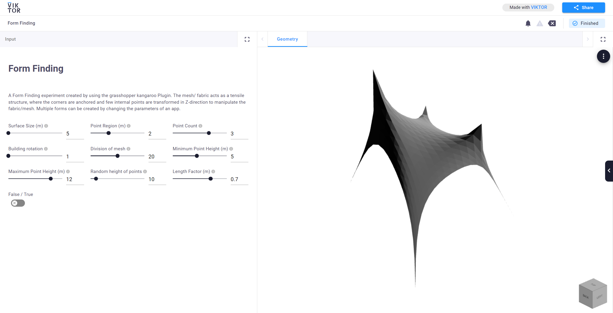

# Form_Finding

## Introduction
A Form Finding experiment created by using the grasshopper kangaroo Plugin. The mesh/ fabric acts as a tensile structure, where the corners are anchored and few internal points are transformed in Z-direction to manipulate the fabric/mesh. Multiple forms can be created by changing the parameters of an app.

# Do you want to create an app by yourself?

If you wish to try to create a VIKTOR app using the same Rhino-Grasshopper file, feel free to do so.

## Steps

1. Clone the repository.
2. Follow VIKTOR Grasshopper [tutorial](https://docs.viktor.ai/docs/getting-started/tutorials/grasshopper-tutorial)
3. particularly check [4. Use your own Grasshopper model](https://docs.viktor.ai/docs/getting-started/tutorials/grasshopper-tutorial#4-use-your-own-grasshopper-model)
4. Explore more.